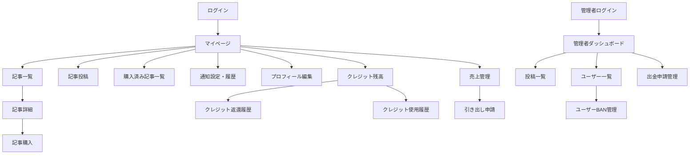

```mermaid
flowchart TD

  %% ユーザー側の画面遷移（マイページ中心構成）
  U_Login[ログイン]
  U_MyPage[マイページ]
  U_ArticleList[記事一覧]
  U_ArticleDetail[記事詳細]
  U_ArticlePost[記事投稿]
  U_Purchase[記事購入]
  U_Purchased[購入済み記事一覧]
  U_Notification[通知設定・履歴]
  U_Profile[プロフィール編集]
  U_CreditBalance[クレジット残高]
  U_CreditRefund[クレジット返還履歴]
  U_CreditUsage[クレジット使用履歴]
  U_Sales[売上管理]
  U_Withdraw[引き出し申請]

  U_Login --> U_MyPage
  U_MyPage --> U_ArticleList
  U_MyPage --> U_Purchased
  U_MyPage --> U_Notification
  U_MyPage --> U_Profile
  U_MyPage --> U_CreditBalance
  U_CreditBalance --> U_CreditRefund
  U_CreditBalance --> U_CreditUsage
  U_MyPage --> U_Sales
  U_Sales --> U_Withdraw

  U_ArticleList --> U_ArticleDetail
  U_ArticleDetail --> U_Purchase
  U_MyPage --> U_ArticlePost

  %% 管理者側
  A_Login[管理者ログイン]
  A_Dashboard[管理者ダッシュボード]
  A_Articles[投稿一覧]
  A_Users[ユーザー一覧]
  A_BAN[ユーザーBAN管理]
  A_WithdrawAdmin[出金申請管理]

  A_Login --> A_Dashboard
  A_Dashboard --> A_Articles
  A_Dashboard --> A_Users
  A_Users --> A_BAN
  A_Dashboard --> A_WithdrawAdmin
```
