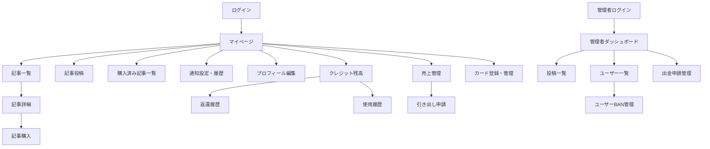

## 開発スケジュール提案書（ギャンブル特化型投稿サービス）

---

### ご提案の背景と進め方

本サービスは「競馬・競輪・競艇」などのギャンブル分野に特化した投稿プラットフォームとして、従来の情報販売サービス（noteやbookersなど）とは異なる、リアルタイム性・信頼性・可視化された実績を強みとした設計を目指します。

本資料は、開発スケジュールおよび機能構成のご提案と、それに基づく概算工数・体制の目安をまとめたものです。

---

### スケジュール概要（マイルストーン方式 / 余裕を持った構成）

| フェーズ | 期間 | 主な内容 |
|----------|------|----------|
| Phase 0：要件定義・構成設計 | 0.5ヶ月 | ペルソナ設計 / 投稿・購入フロー設計 / 通知・クレジット・収益構造の設計など ※本フェーズではクライアント様との密なディスカッションが必要です。 |
| Phase 0.5：UI/UXデザイン | 1ヶ月 | 全画面のUI/UX設計（Figma） / モバイル設計 / 開発仕様の整理 ※設計内容によっては、機能追加・削除の判断も発生し得ます。 |
| Phase 1：MVP開発 | 3ヶ月 | 以下の全機能を含む：
- 投稿・購入（有料/無料）
- Stripe決済＋クレジットカード登録
- 閲覧制御（購入者のみ全文）
- 締切設定・締切通知
- クレジット（残高確認ページ／返還履歴ページ／使用履歴ページ）
- 売上管理・引き出し申請
- SNS連携（X/Twitter API）
- レスポンシブUI / SEO / 管理画面
- 購入済み記事一覧やマイページ中心のUX導線

---

### Phase 1（MVP）機能一覧

| カテゴリ | 機能 |
|----------|------|
| 投稿 | 記事作成（有料/無料・締切設定）／公開設定 |
| 閲覧制御 | ロック表示／購入ユーザーのみに全文表示 |
| 決済 | Stripe即時決済＋クレジットカード登録＋手数料控除 |
| 通知 | 締切前通知（メール）／通知タイミング設定 |
| クレジット | クレジット残高表示ページ／返還履歴ページ／使用履歴ページ |
| 売上管理 | 投稿別売上表示／収益ダッシュボード |
| 引き出し | 銀行口座 / PayPalなどへ申請制で対応 |
| SNS連携 | X（旧Twitter）自動投稿API連携 |
| SEO / UX | モバイル最適化／OGP／シンプルUI設計／購入済み記事一覧・マイページ中心導線 |
| 管理機能 | 投稿一覧／ユーザー一覧／簡易BAN管理 |

---

### 想定工数・開発費用（MVP開発）

以下は、現時点で想定されるMVP開発に必要な体制と概算金額です。

| 担当 | 工数（人日） | 月単価 | 金額（税抜） |
|------|---------------|--------|----------------|
| PM（プロジェクト管理） | 約25人日 | 100万円 | 約1,250,000円 |
| SE（システム開発）     | 約100人日 | 80万円  | 約4,000,000円 |
| デザイナー（UI/UX設計）| 約40人日 | 80万円  | 約1,500,000円 |

**PM＋SE 合計金額（税抜）：約5,250,000円 → ご提案価格：500万円台前半（税抜）**

**デザイン費（税抜）：約1,500,000円（※ご希望に応じて分離・調整可能）**

**全体合計金額（税抜）：約6,750,000円 → ご提案価格：応相談**

> 本見積は、現時点でのご要望と仮のスコープに基づいており、Phase 0・0.5での要件定義や設計フェーズにて内容が更新される可能性があります。
> 特に、機能の追加・削除・優先度変更などによって金額やスケジュールは変動することが想定されるため、
> ご提案価格および工数はあくまで「初期検討の目安」としてご認識いただければ幸いです。

---

### 提案の強みと方針

私たちは、単にご依頼いただいた内容を開発するだけでなく、**事業の成功を共に目指す「チームの一員」として参画**する姿勢を大切にしています。

- 開発初期から運用・改善フェーズに至るまで、課題に対して積極的に提案し、クライアントと同じ目線でサービス成長を支援します。
- MVPにおいて「投稿→購入→締切通知→外れたらクレジット返還→売上管理→引き出し」までのフローをすべてカバー。
- ギャンブル情報の性質に合わせて「締切通知」と「信頼性（返還）」を初期から実装。
- note/bookersとの差別化として、リアルタイム性 × 信頼性 × 実績の可視化 を軸に構築。
- ユーザーに優しい導線設計として、「マイページ中心構造」「購入済み記事一覧」「通知・履歴ページ」「カード登録管理ページ」などを初期から組み込み。

---

### 保守・運用について

リリース後の保守・運用では、以下のような**基本的な監視と軽微な修正、およびマーケティング支援を含むコンサルティング対応**を行います。

- サイトの死活監視
- 軽微なテキスト・UI修正
- 管理画面や投稿の簡易調整
- マーケティング施策やユーザー行動を踏まえた改善提案（月次レビューなど）

> ※新機能の追加や大幅な改修については、別途お見積もりとさせていただきます。

**想定月額費用：10〜12万円（税抜）**

---

### 今後の展望（Phase 2以降）

- 的中率・回収率・投稿者ランキング
- Push通知 / LINE通知連携
- プレミアム会員プラン・サブスク機能
- フォロー・タイムライン型のUI拡張

---

## ページ遷移図（Mermaid構文）

